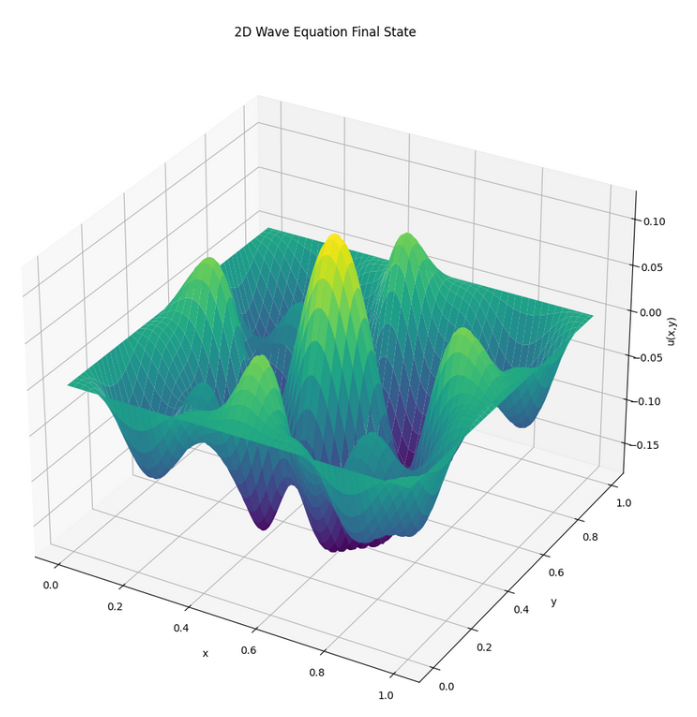
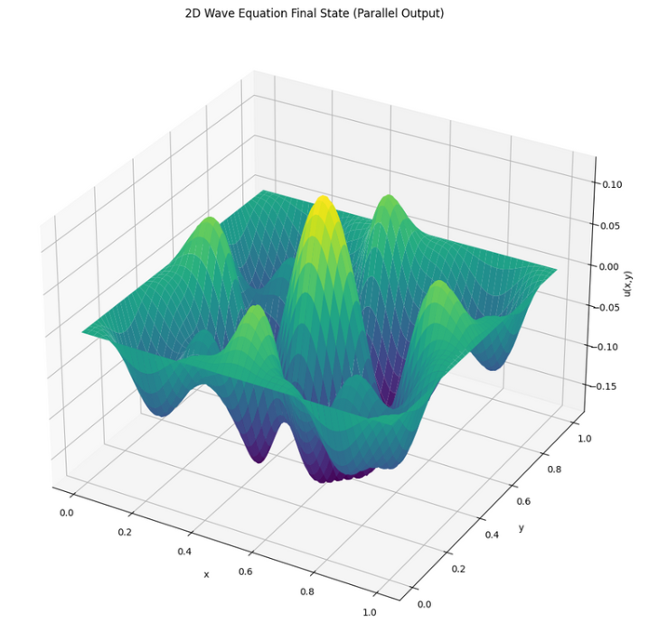

# 2D Wave Equation Solver (Serial & Parallel - MPI)

This project numerically solves the 2D wave equation using finite difference methods. It includes both a serial (single-threaded) and a parallel implementation using MPI for distributed computing.

## 1. Project Structure

```
PDP_20242/
├── src/
│   ├── 2DWaveEquation.cpp        # Serial implementation
│   └── Parallel.cpp              # Parallel MPI implementation
├── output_serial/                # Output from serial run
│   └── wave_output.dat
├── output_parallel/              # Output from parallel run
│   └── wave_rank*.dat
├── plot_serial.py                # Python script to plot serial result
├── plot_parallel.py              # Python script to plot parallel result
└── README.md
```

## 2. Goals
- Solve the 2D wave equation over a unit square domain.
- Compare performance between serial and parallel implementations.
- Visualize the wave surface using `matplotlib`.

---

## 3. Requirements

### C++ and MPI
- `g++` or `mpic++` compiler
- `OpenMPI` (or compatible MPI implementation)

Install OpenMPI (Ubuntu):
```bash
sudo apt update
sudo apt install openmpi-bin libopenmpi-dev
```

### Python (for visualization)
```bash
pip install matplotlib numpy
```

---

## 4. Build Instructions

### Serial Version
```bash
cd src
mkdir -p ../output_serial
g++ 2DWaveEquation.cpp -o ../output_serial/wave_serial -O2
cd ..
```

### Parallel Version (MPI)
```bash
cd src
mkdir -p ../output_parallel
mpic++ Parallel.cpp -o ../output_parallel/wave_parallel -O2
cd ..
```

---

## 5. Run Instructions

### Serial
```bash
./output_serial/wave_serial
```
Output: `output_serial/wave_output.dat`

### Parallel (run with 9 parallel processes)
```bash
mpirun -np 9 ./output_parallel/wave_parallel
```
Output: `output_parallel/wave_rank0.dat`, `wave_rank1.dat`, ...

You can adjust the number of processes (`-np`) as needed.

---

## 6. Visualization

### Plot Serial Result
```bash
python plot_serial.py
```
Expected Output: Visual surface of wave from `wave_output.dat`

### Plot Parallel Result
```bash
python plot_parallel.py
```
Expected Output: Combined wave surface from `wave_rank*.dat`

---

## 7. Performance Note
- Serial runtime is stored internally.
- Parallel runtime is printed and saved to `performance_parallel.txt`

You can compare runtimes to analyze speedup and scaling.

---

## 8. Sample Plots
*Serial Output:*


*Parallel Output:*


